# 🏗️ VillageCrop - Architecture Diagrams

Complete Mermaid flow diagrams for the VillageCrop application architecture.

---

## 1. High-Level System Architecture

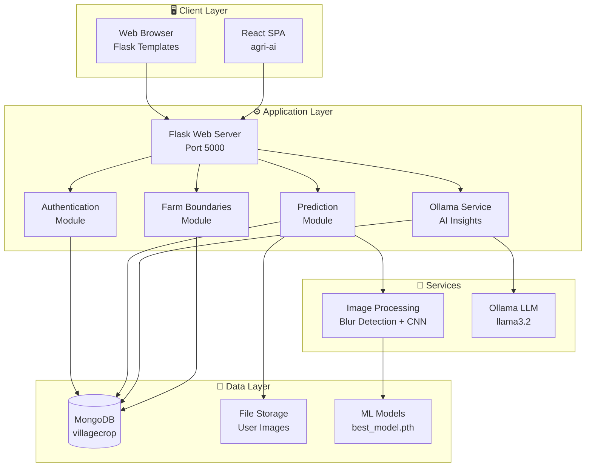

---

## 2. Data Flow - Prediction Pipeline

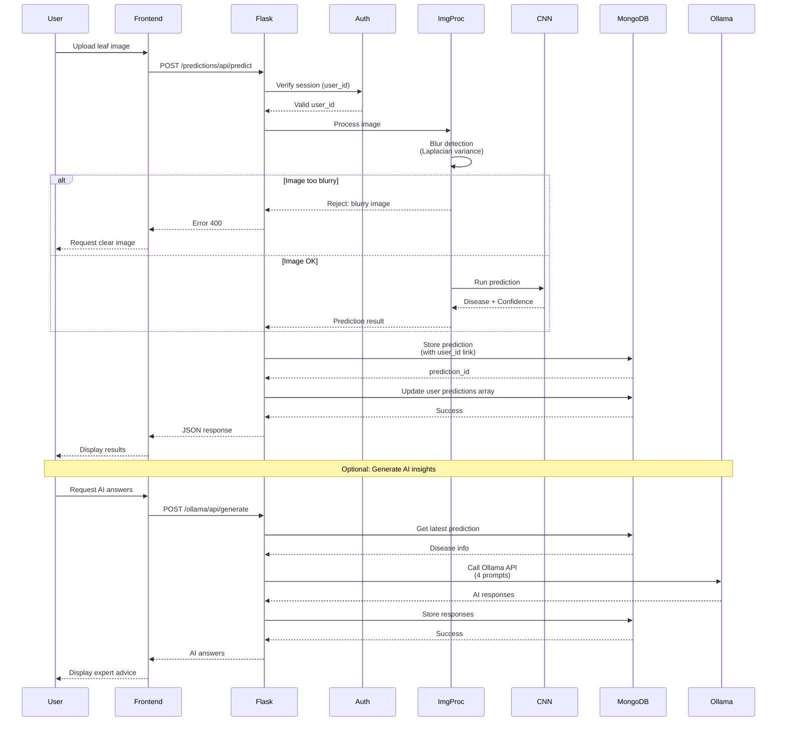

---

## 3. MongoDB Entity Relationship

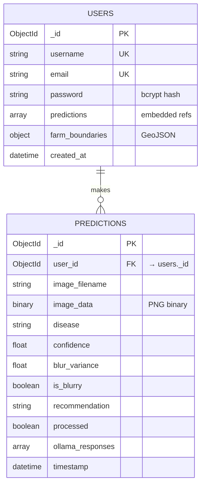

---

## 4. CNN Model Architecture

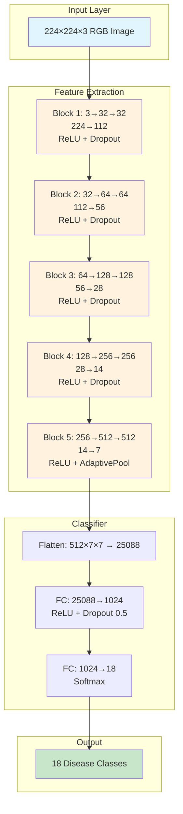

---

## 5. Application Module Dependencies

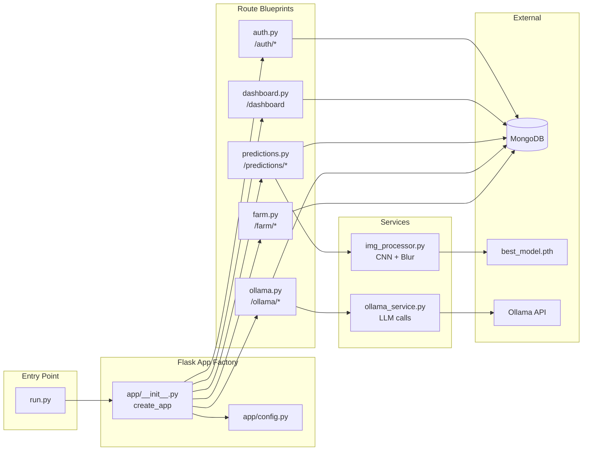

---

## 6. User Authentication Flow

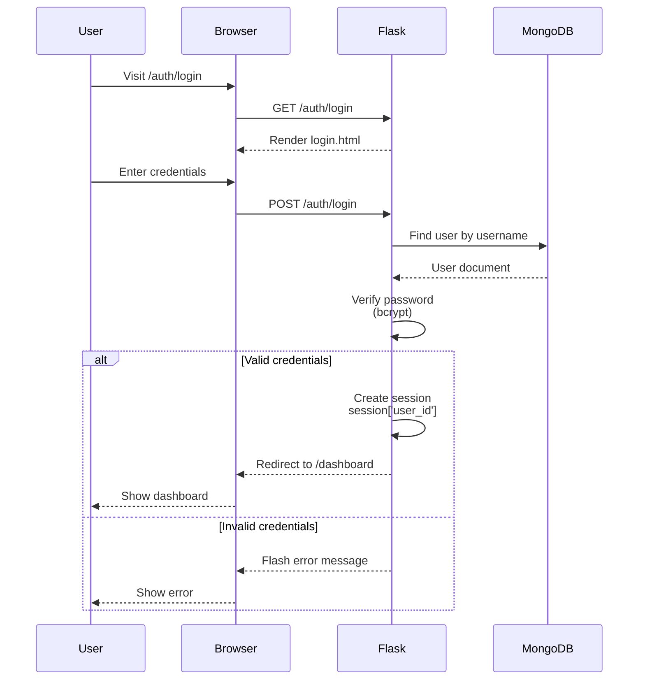

---

## 7. Image Processing Pipeline

```mermaid
flowchart LR
    subgraph Input["Input"]
        IMG[Uploaded Image]
    end

    subgraph Preprocess["Preprocessing"]
        Resize[Resize to 224×224]
        Norm[Normalize RGB<br/>ImageNet stats]
        Tensor[Convert to Tensor]
    end

    subgraph Quality["Quality Check"]
        Gray[Convert to Grayscale]
        Lap[Laplacian Transform]
        Var[Calculate Variance]
        Check{Variance > 100?}
    end

    subgraph CNN["CNN Inference"]
        F1[Feature Block 1]
        F2[Feature Block 2]
        F3[Feature Block 3]
        F4[Feature Block 4]
        F5[Feature Block 5]
        Class[Classifier Head]
    end

    subgraph Output["Output"]
        Disease[Disease Class]
        Conf[Confidence Score]
        Rec[Recommendation]
    end

    IMG --> Resize --> Norm --> Tensor
    IMG --> Gray --> Lap --> Var --> Check
    Check -->|Pass| Tensor
    Check -->|Fail| Reject[Reject: Too Blurry]
    
    Tensor --> F1 --> F2 --> F3 --> F4 --> F5 --> Class
    Class --> Disease --> Conf --> Rec

    style IMG fill:#e1f5fe
    style Reject fill:#ffcdd2
    style Disease fill:#c8e6c9
    style Conf fill:#c8e6c9
    style Rec fill:#c8e6c9
```

---

## 8. Complete User Journey

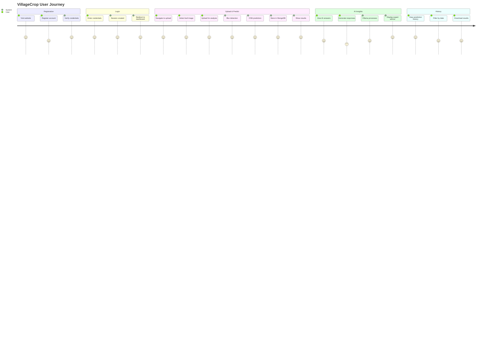

---

## 9. Component Architecture (React Frontend)

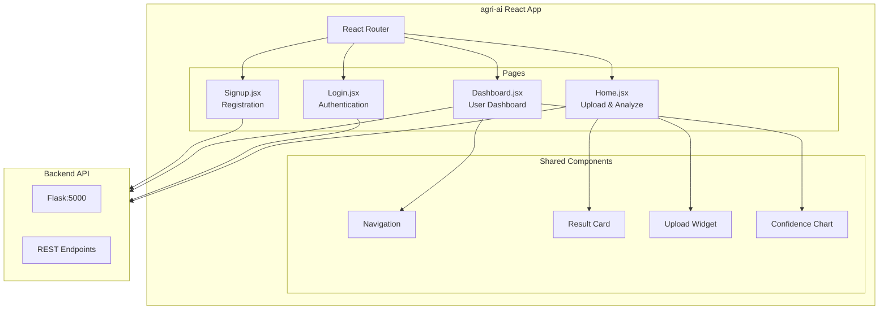

---

## 10. Disease Classification Hierarchy

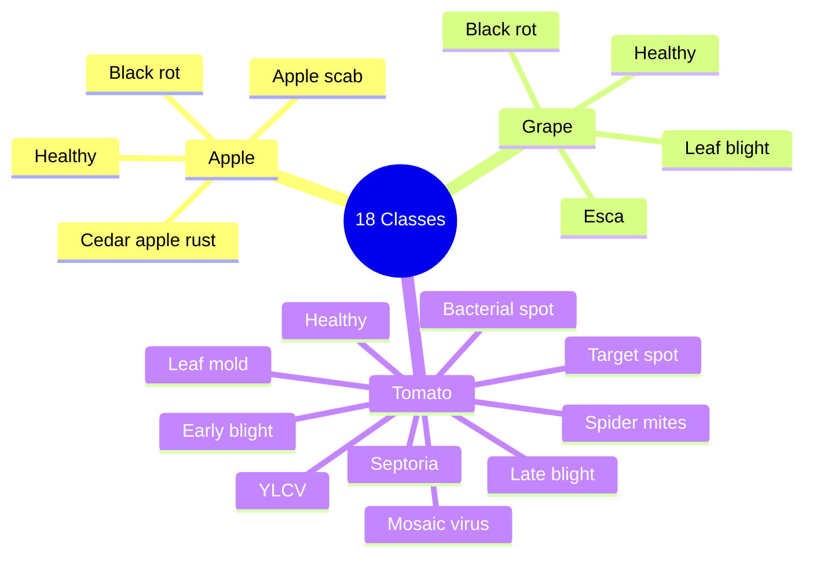

---

## 11. Technology Stack Overview

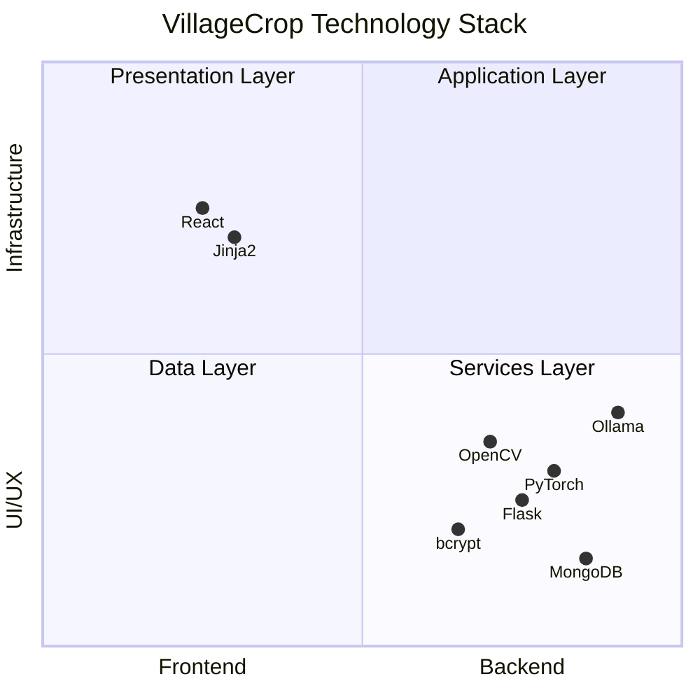

---

## 12. Deployment Architecture (Future)

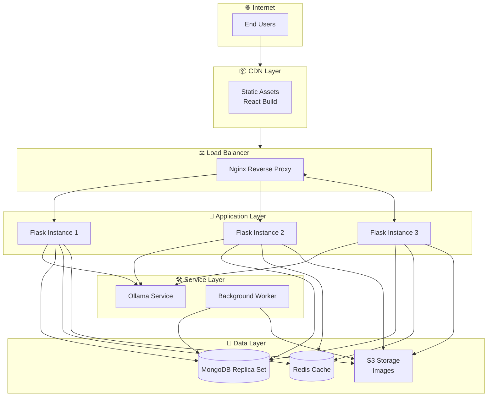

---

**Last Updated:** April 2026  
**Version:** 1.0
