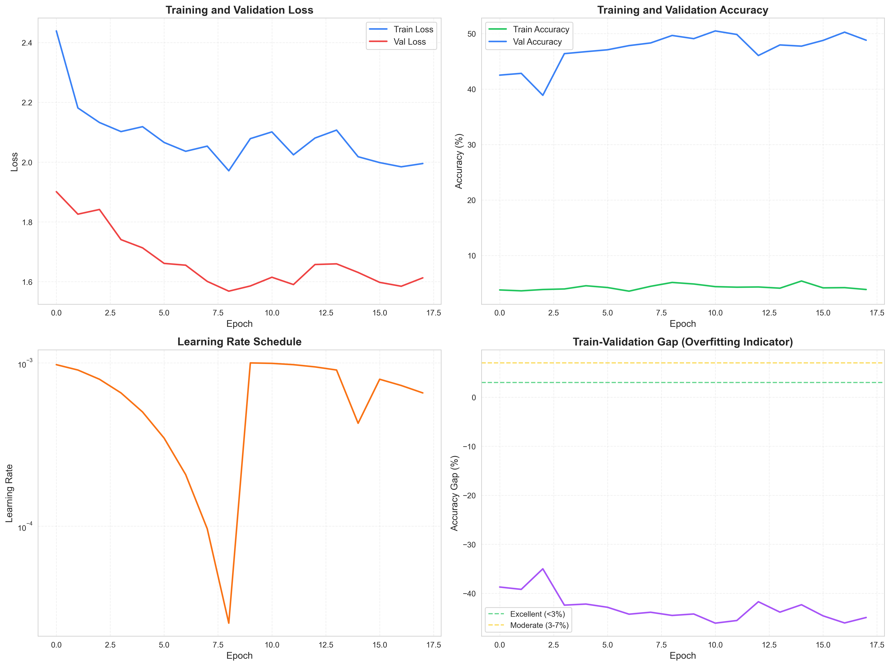

#  AgroDoc-AI - AI-Powered Plant Disease Detection System

A comprehensive full-stack web application for plant disease detection using deep learning and AI-powered expert insights.




##  Key Features

### Core Functionality
-  **User Authentication** - Register/login with bcrypt password hashing
-  **OTP Verification** - Email-based OTP for registration and login
-  **Image Upload** - Drag-and-drop with camera capture support
-  **Blur Detection** - Automatic image quality check using Laplacian variance
-  **CNN Prediction** - Deep learning model for disease classification (18 classes)
-  **Non-Leaf Rejection** - Automatically rejects invalid images (<50% confidence)
-  **AI Expert Insights** - Ollama Phi-3 integration for Q&A about detected diseases
-  **Prediction History** - Full history of user's uploads and predictions
-  **Farm Boundaries** - GeoJSON/KML upload for farm location tracking

### Supported Plant Diseases (18 Classes)
| Plant | Diseases |
|-------|----------|
| **Apple** | Apple scab, Black rot, Cedar apple rust, Healthy |
| **Grape** | Black rot, Esca (Black Measles), Leaf blight, Healthy |
| **Tomato** | Bacterial spot, Early blight, Late blight, Leaf mold, Septoria leaf spot, Spider mites, Target spot, Yellow leaf curl virus, Mosaic virus, Healthy |


##  Quick Start

### 1. Install Dependencies

```bash
pip install -r requirements.txt
```

### 2. Configure Environment

Edit `.env` file with your settings:

```env
# MongoDB
MONGODB_URI=mongodb://localhost:27017/agrodoc-ai

# Gmail SMTP (for OTP)
MAIL_USERNAME=your-email@gmail.com
MAIL_PASSWORD=your-app-password
```

**Get Gmail App Password:** https://myaccount.google.com/apppasswords

### 3. Initialize Database

```bash
python scripts/init_db.py
```

### 4. Start Application

**Windows:** Double-click `start.bat`

**Manual:**
```bash
python run.py
```

Access at: **http://localhost:5000**


##  Test Credentials

**Default Test User:**
- Username: `testuser`
- Password: `test123`

**Or register a new account with email verification!**


##  Project Structure

```
VILLAGECROP/
├──  app/                          # Flask Web Application
│   ├── __init__.py                  # Flask app factory
│   ├── config.py                    # Configuration & disease recommendations
│   ├── routes/
│   │   ├── auth.py                  # Login/Register/OTP (with email verification)
│   │   ├── dashboard.py             # User dashboard
│   │   ├── predictions.py           # Image upload & CNN prediction
│   │   ├── ollama.py                # AI expert responses + chatbot
│   │   └── farm.py                  # Farm boundaries (GeoJSON/KML)
│   ├── services/
│   │   ├── image_processor.py       # Blur detection + CNN prediction + non-leaf rejection
│   │   ├── ollama_service.py        # Ollama LLM integration
│   │   └── otp_service.py           # Email OTP generation & verification
│   ├── templates/
│   │   ├── base.html                # Base template
│   │   ├── auth/                    # Login/Register/OTP verification
│   │   ├── dashboard/               # Dashboard page
│   │   ├── predictions/             # Upload/History pages + chatbot
│   │   ├── ollama/                  # AI answers page
│   │   └── farm/                    # Farm boundaries page
│   └── static/
│       └── css/
│           └── agri-ai-replica.css  # Premium dark theme
├──  models/                        # ML Models & Metrics
│   ├── best_model.pth               # Trained EfficientNet-B0
│   ├── class_mapping.json           # Class index mapping
│   ├── performance_metrics.json     # Model evaluation metrics
│   └── plots/                       # Visualization plots
├──  scripts/                       # Utility Scripts
│   └── init_db.py                   # Database initialization
├── 📄 run.py                         # Main application entry point
├── 📄 start.bat                      # Windows launcher
├── 📄 requirements.txt               # Python dependencies
├── 📄 .env                           # Environment variables (DO NOT COMMIT)
└── 📄 README.md                      # This file
```


##  Model Performance

### Transfer Learning Results
- **Model:** EfficientNet-B0 (frozen backbone)
- **Training Samples:** 10,072 (50%)
- **Validation Samples:** 10,072 (50%)
- **Classes:** 18 (Apple, Grape, Tomato only)

### Performance Metrics
- **Overall Accuracy:** 92.30%
- **Macro F1-Score:** 0.9098
- **Weighted F1-Score:** 0.9226

### Best Performing Classes
1. Tomato___Tomato_Yellow_Leaf_Curl_Virus: F1=0.990
2. Grape___Leaf_blight: F1=0.987
3. Apple___healthy: F1=0.977

See `models/performance_metrics.json` for detailed metrics.


## 🔧 Configuration

### Environment Variables (.env)

```env
# MongoDB
MONGODB_URI=mongodb://localhost:27017/villagecrop

# Flask
SECRET_KEY=your-secret-key-here

# Ollama (Local LLM)
OLLAMA_API_URL=http://localhost:11434/api/generate
OLLAMA_MODEL=phi3

# Gmail SMTP (OTP Email)
MAIL_SERVER=smtp.gmail.com
MAIL_PORT=587
MAIL_USE_TLS=true
MAIL_USERNAME=your-email@gmail.com
MAIL_PASSWORD=your-16-char-app-password
MAIL_DEFAULT_SENDER=your-email@gmail.com
```

### Ollama Setup

1. Install Ollama: https://ollama.ai
2. Pull Phi-3 model:
   ```bash
   ollama pull phi3
   ```
3. Start Ollama server:
   ```bash
   ollama serve
   ```

See `OLLAMA_SETUP_PHI3.md` for detailed setup.


##  Documentation

| Document | Description |
|----------|-------------|
| `README.md` | This file - main documentation |
| `QUICKSTART.md` | Quick start guide |
| `PROJECT_README.md` | Detailed project overview |
| `ARCHITECTURE_DIAGRAMS.md` | System architecture diagrams |
| `FIX_OVERFIT_GUIDE.md` | Model overfitting solutions |
| `TRANSFER_LEARNING_GUIDE.md` | Transfer learning implementation |
| `NON_LEAF_REJECTION.md` | Image rejection system |
| `CHATBOT_FEATURE.md` | AI chatbot feature |
| `GMAIL_OTP_SETUP.md` | Gmail OTP email setup |
| `OLLAMA_SETUP_PHI3.md` | Ollama Phi-3 configuration |


##  Development

### Run Training Script

```bash
python transfer_learning_apple_grape_tomato.py
```

### Evaluate Model

```bash
python evaluate_model.py
```

### Plot Metrics

```bash
python plot_metrics.py
```

### Test with TTA (Test-Time Augmentation)

```bash
python predict_with_tta.py path/to/image.jpg
```

---

##  Security Features

-  **Password Hashing** - bcrypt with salt
-  **OTP Verification** - Email-based 2FA for registration/login
-  **Session Management** - Secure Flask sessions
-  **Input Validation** - Server-side validation for all inputs
-  **Non-Leaf Rejection** - Confidence threshold (50%) to reject invalid images
-  **Rate Limiting** - OTP resend cooldown (60s), max attempts (5)


##  MongoDB Schema

### users Collection
```javascript
{
  _id: ObjectId,
  username: String,
  email: String,
  password: String (bcrypt hashed),
  email_verified: Boolean,
  farm_boundaries: GeoJSON,
  predictions: [ObjectId],
  created_at: Date
}
```

### predictions Collection
```javascript
{
  _id: ObjectId,
  user_id: ObjectId,
  image_data: Binary,
  disease: String,
  confidence: Number,
  blur_result: Object,
  ollama_responses: [String],
  chatbot_messages: [Object],
  timestamp: Date
}
```


##  Troubleshooting

### MongoDB Connection Error
```bash
# Ensure MongoDB is running
mongod --dbpath C:\data\db
```

### OTP Email Not Sending
1. Check Gmail App Password is correct
2. Verify 2FA is enabled on Google account
3. Check `.env` has correct SMTP settings
4. See `GMAIL_OTP_SETUP.md` for detailed guide

### Ollama Not Responding
```bash
# Check if Ollama is running
ollama list

# Restart Ollama server
ollama serve
```

### Model Not Found
Ensure `best_model.pth` exists in `models/` folder. If not, run training:
```bash
python transfer_learning_apple_grape_tomato.py
```


##  Support

For issues or questions:
1. Check documentation in `/docs` folder
2. Review troubleshooting section above
3. Check Flask console for error messages


## Acknowledgments

- **PlantVillage Dataset** - Open access dataset for plant disease detection
- **Ollama** - Local LLM runtime for Phi-3 model
- **EfficientNet** - Pre-trained CNN architecture
- **Flask** - Lightweight Python web framework


